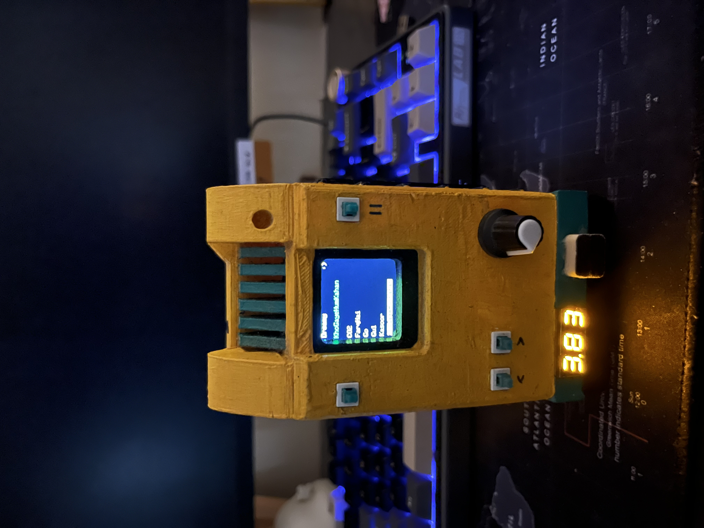
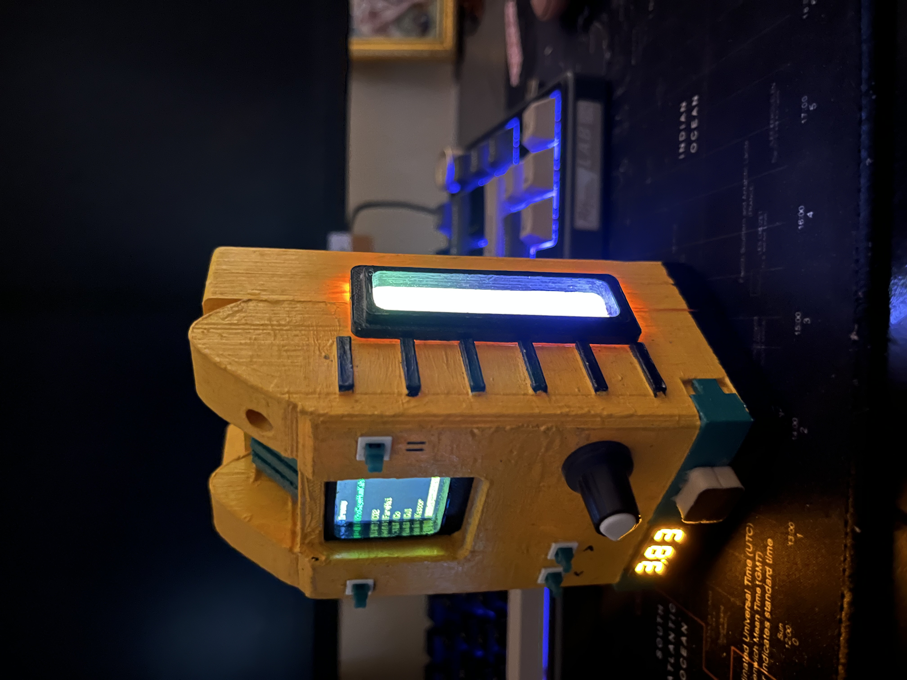
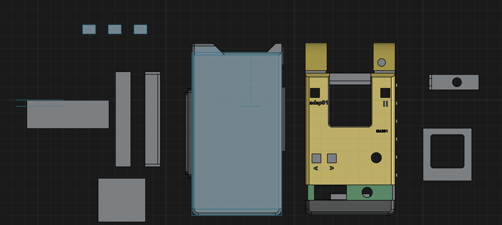

# CyberPlayer

CyberPlayer is a music player project that allows you to play music files using a microcontroller. This README provides an overview of the project and details on how to set up the hardware pin connections.





## Features

- Play music files from storage
- Control playback with buttons
- Display song information on an LCD

## Pin Connections

Ensure the following pin connections are made between the microcontroller and the peripherals:

| Microcontroller Pin | Peripheral        | Peripheral Pin |
|---------------------|-------------------|----------------|
| GPIO2               | LCD Data Pin D4   | D4             |
| GPIO3               | LCD Data Pin D5   | D5             |
| GPIO4               | LCD Data Pin D6   | D6             |
| GPIO5               | LCD Data Pin D7   | D7             |
| GPIO12              | LCD Register Select (RS) | RS     |
| GPIO13              | LCD Enable (E)    | E              |
| GPIO14              | Button Play/Pause | Button Pin     |
| GPIO15              | Speaker Output    | Positive (+)   |

*Note: Replace GPIO pins with the actual pins used in your project.*

## Installation

1. Clone this repository:
    ```bash
    git clone https://github.com/yourusername/CyberPlayer.git
    ```
2. Navigate to the project directory:
    ```bash
    cd CyberPlayer
    ```
3. Upload the code to your microcontroller using your preferred method.

## Usage

- Press the Play/Pause button to start or pause playback.
- Music files should be placed in the `music` directory on the storage medium.
- The LCD will display the current song information.

## Music File Structure on the SD Card

To ensure the CyberPlayer can locate and play your music files correctly, organize them on the SD card as follows:

1. **Create Folders at the Root Level:**
    - At the root directory of the SD card, create folders to categorize your music (e.g., `Rock`, `Jazz`, `Classical`). These folders will appear in the main menu.

2. **Place WAV Files Inside Folders:**
    - Inside each folder, place your music files in WAV format. The player will list these files when you select a folder from the main menu.

3. **File Naming:**
    - Use simple file names without special characters to ensure compatibility.

**Example Structure:**

```
/ (root)
├── Rock
│   ├── song1.wav
│   ├── song2.wav
├── Jazz
│   ├── track1.wav
│   ├── track2.wav
```

After setting up the SD card, insert it into the CyberPlayer's SD card slot. The player will display the list of folders, allowing you to navigate and select songs to play.

## License
This project is licensed under the MIT License.
